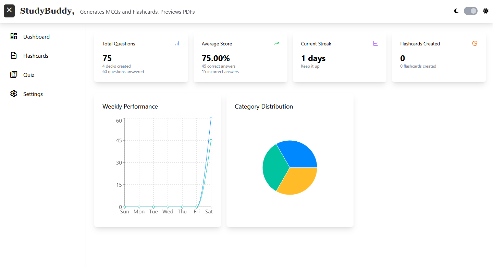

# StudyBuddy

I was preparing for midterms and I had the idea to make a simple MCQ and Flashcards generator from PDF folders to help me studying without getting bored. It also previews PDF.

## Technologies I used

- Client Side: Typescript, Axios, React, Tailwind, react-pdf
- Server Side: Google Gemini API, Express, Multer

## Images

## TODOs

- [X] Adding correction labels;
- [ ] Adding a Save to Favourite to MCQs (maybe flashcards too);
- [X] Fixing flashcards;
- [ ] Saving modifications automatically;
